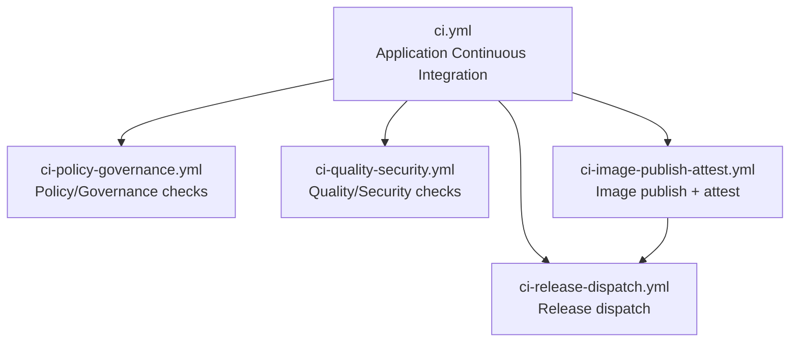

Use a small number of explicit workflows in this repository.

## Deployment Model

- Deployment Model: External environment-repository promotion
- Push-to-environment deployment from this repo: Disabled
- Protected branch ladder: `feat|fix|codex|... -> development -> testing -> staging -> main`

This repository builds, signs, and attests application images, then emits a repository dispatch event to `ethio-connect-environments`.
Environment overlays, promotion between environments, and rollback remain outside this repository boundary.

## Workflow Architecture

| Workflow                                        | Owner                                      | Trigger                                                    | Inputs                                                                                                                                                                                    | Outputs                                                                                                                  | Notes                                                                                                                                   |
| ----------------------------------------------- | ------------------------------------------ | ---------------------------------------------------------- | ----------------------------------------------------------------------------------------------------------------------------------------------------------------------------------------- | ------------------------------------------------------------------------------------------------------------------------ | --------------------------------------------------------------------------------------------------------------------------------------- |
| `.github/workflows/ci.yml`                      | Platform Engineering                       | `pull_request`, `merge_group`, `push`, `workflow_dispatch` | n/a                                                                                                                                                                                       | n/a                                                                                                                      | Orchestrator that calls reusable CI workflows and enforces stage ordering.                                                              |
| `.github/workflows/ci-policy-governance.yml`    | Platform Engineering                       | `workflow_call`                                            | `node_version`, `pnpm_version`, `event_name`, `base_ref`, `head_ref`                                                                                                                      | n/a                                                                                                                      | Branch ladder enforcement, workflow linting, immutable action pin checks.                                                               |
| `.github/workflows/ci-quality-security.yml`     | Security + Platform Engineering            | `workflow_call`                                            | `node_version`, `pnpm_version`, `event_name`, `ref_name`, `base_ref`                                                                                                                      | n/a                                                                                                                      | Dependency review, Snyk, CodeQL, deploy asset checks, Nx lint/typecheck/test/build.                                                     |
| `.github/workflows/ci-image-publish-attest.yml` | Security Provenance + Platform Engineering | `workflow_call`                                            | `node_version`, `pnpm_version`                                                                                                                                                            | `infra_environment`, `target_branch`, `image_tag`, `release_version`, `applications_json`, `attestation_references_json` | Protected-branch image publish, SBOM generation, signing, provenance attestation.                                                       |
| `.github/workflows/ci-release-dispatch.yml`     | Platform Engineering                       | `workflow_call`                                            | `source_sha`, `source_ref`, `target_environment`, `image_tag`, `release_version`, `release_schema_version`, `applications_json`, `attestation_references_json`, `environments_repository` | n/a                                                                                                                      | Validates payload against the versioned schema, then dispatches `app-release-published` to `ethio-connect-environments` (staging only). |
| `.github/workflows/release.yml`                 | Release Management                         | `workflow_dispatch`                                        | `version`, `source_sha`, `changelog`, `prerelease`                                                                                                                                        | n/a                                                                                                                      | Manual release metadata and post-publish release artifacts/signing flow.                                                                |
| `.github/workflows/release-drafter.yml`         | Release Management                         | `push` to `main`, `workflow_dispatch`                      | n/a                                                                                                                                                                                       | n/a                                                                                                                      | Maintains draft release notes for `main`.                                                                                               |

## Shared Workflow Conventions

- **Reusable workflow boundary:** responsibilities are split into policy/governance, quality/security, image publish/attest, and release dispatch; `ci.yml` is the only orchestration entrypoint.
- **Consistent runtime inputs:** reusable workflows accept `node_version` and `pnpm_version` where Node toolchain setup is required.
- **Timeout convention:** default CI jobs use `20` minutes unless intentionally extended (`60` minutes for Nx validation, `90` minutes for image publish).
- **Concurrency convention:** each reusable workflow defines a deterministic workflow-level concurrency group and cancels non-push superseded runs.
- **Artifact retention convention:** CI artifacts in reusable workflows default to `30` days retention.

## Deliberate Omissions From The Source Repo Structure

This repository does not own:

- environment inventory mutation
- environment promotion
- environment rollback
- cluster bootstrap or admission policy state

Those responsibilities belong to `ethio-connect-environments`, `ethio-connect-platform`, and `ethio-connect-security-provenance`.

Ownership validation note: changes under `.github/workflows/**` should request review from `@ethio-connect/platform-team` via CODEOWNERS.
